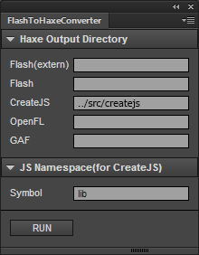

FlashToHaxeConverter
=======================
Document Language [[English](README.md)] | [Japanese]

FlashToHaxeConverter は、Flash CC 内構造を Haxe クラスに出力する拡張パネルです。
Flash コンテンツ用(二種類)、Toolkit for CreateJS (html5 canvas コンテンツ)用、OpenFL、GAF 用の合計 5種類の出力が可能です。

出力した Haxe クラスは new で生成できます。

	var gameAreaView = new GameAreaView();
	addChild(gameAreaView);

MovieClip 内部に配置した MovieClip へのアクセスも容易になります。

	var playerPosition = gameAreaView.playerArea.player;

---
## Download (Flash Pro CC)

* [FlashToHaxeConverter.zxp](https://raw.github.com/siratama/Flash-To-Haxe-Converter/master/download/FlashToHaxeConverter.zxp)

Flash Pro CC 以降のバージョンで利用可能です。Windows の場合、右クリックから「リンク先のコンテンツを保存」を選択で保存できます。
インストールには別途 [Extension Manager Command Line tool(ExManCmd)](https://www.adobeexchange.com/resources/28)が必要です。

---
## Download (Etc)

* [Linkage](https://github.com/siratama/Linkage)

リンケージ設定用拡張パネルです。FlashToHaxeConverter と一緒にご利用ください。

---
## Usage

RUN ボタンを押すことで、ライブラリ内 リンケージ設定を行ったシンボル設定そのままに Haxe ファイルの出力が行われます。

テキストフィールドを空にすると、出力は行われなくなります。以下の図の場合、CreateJS-Haxe のファイル群のみ出力されます。

fla ファイルと異なるディレクトリに出力したい場合、相対パス指定を行います。

---
## FAQ

### 出力ファイル Flash(extern) と Flashの違い

#### Flash(extern)

* Haxe のコンパイルオプション -swf-lib にて「素材用 swf」を「Haxe から出力する swf」内に埋め込む場合に利用

#### Flash

* Loader クラス等を用い 「素材用 swf」 を外部から読み込む場合に利用

---
## Features

### html6 canvas 用 独自出力

CreateJS用に出力された各 Haxe ファイルには、
html5 canvas ドキュメントから出力された javascript ファイルにアクセスしやすくなるような以下のプロパティを追加しています。

* Sound.manifestId 
* Bitmap.manifestId 
* Bitmap.nominalBounds
* Container.nominalBounds
* MovieClip.nominalBounds

---
## .hx ファイル削除に関して

fla ファイル内ライブラリの構造に変更を行った場合、Haxe 出力ディレクトリ内には以前の無駄なファイルが残ってしまいます。
無駄なファイルの削除を行いたい場合、手動で Haxe 出力ディレクトリの削除をお願いします。

---
## 制限事項
### OpenFL-Haxe or GAF-Haxe

出力された OpenFL, GAF 用 hx ファイルの使用には制限事項があります。
View という名前の MovieClip を OpenFL, GAF 用として出力した場合、
View.hx(抽象型)は親に MovieClip を持っていないため、以下の trace 文はエラーとなります。

	var view = new View();
	addChild(view); //ok
	trace(view.x); //error

エラーを避けるためには一度 cast を行う必要があります。

	var view = new View();
	addChild(view);
	var mc:MovieClip = cast view;
	trace(mc.x); //ok

Type.createInstance メソッド経由での生成は意図通り行えません。

	var view = Type.createInstance(View, []);
	addChild(view); //error

以下の記述ですと生成は可能です。

	var view = Type.createInstance(View, [])._new();
	addChild(view); //ok

クロスプラットフォームプログラミングを行いたい場合、以下の様な TypeUtil クラスを用意しておくと便利です。

[TypeUtil.hx](https://gist.github.com/siratama/4f46732f912ec031d8d1)

### OpenFL-Haxe

swf 内に埋め込んだサウンドを取得するメソッドは、OpenFL には現在用意されていません。
コンパイル用 xml ファイルに使用するサウンドファイルを手動で登録する必要があります。

	<assets path="test/JumpSound.wav" id="test.JumpSound" />

FlashToHaxeConverter から出力されるサウンド用 test.JumpSound.hx ファイルのコンストラクタには、
以下の様な記述が行われるので、new JumpSound(); という記述で Sound インスタンスの生成が可能となります。

	public function new()
		this = Assets.getSound('test.JumpSound');

---
## サンプル

* [Flash](examples/flash/)
* [OpenFL](https://github.com/siratama/FlashAndCppOutputUsingSwfFromOpenFL)
* [GAF](https://github.com/siratama/HaxeSampleUsingGAF)

---
## 外部ライブラリ

* [CreateJS extern](https://github.com/)

---
## 開発用ライブラリ

* [haxe-jsfl](https://github.com/tmskst/haxe-jsfl)

